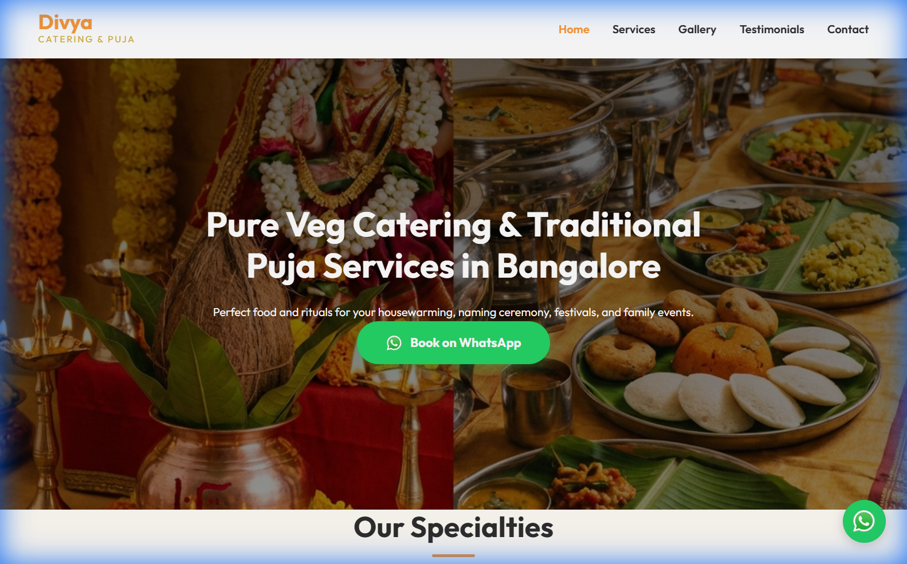
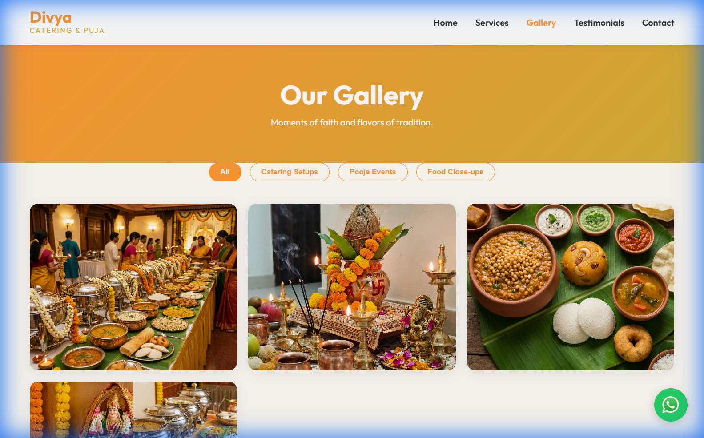

# Divya Catering & Puja Services - Website Project Overview

## 🏁 Project Summary
A premium, multi-page web application built for **Divya Catering & Puja Services** based in Bangalore. The website is designed with a "Traditional Modern" aesthetic to appeal to families looking for authentic Satvik catering and Vedic Puja rituals. 

The primary goal of the site is **Lead Generation via WhatsApp**, featuring prominent calls-to-action (CTAs) and an integrated enquiry system.

---

## 📸 Visual Preview

### Home Page

*Figure 1: High-impact hero section with primary WhatsApp booking integration.*

### Gallery & Portfolio

*Figure 2: Categorized gallery showing catering setups and puja arrangements.*

---

## 🚀 Key Features

### 1. WhatsApp-Centric Architecture
- **Floating WhatsApp Button**: Accessible from the bottom-right corner on every page.
- **Smart CTAs**: "Book on WhatsApp" buttons use pre-filled messages (e.g., *"Hi, I saw your portfolio and want to book a service"*) to initiate instant conversations.
- **Post-Submission Redirect**: After filling out the contact form, users are encouraged to continue the chat on WhatsApp.

### 2. Full-Service Multi-Page Site
- **Home**: Strategic overview, trust factors, and specialty highlights.
- **Services**: Detailed breakdown of Satvik Catering (Menu types, capacity) and Puja Rituals (Griha Pravesh, Satyanarayan Puja, etc.).
- **Gallery**: A filterable showcase of past events, catering setups, and food close-ups.
- **Testimonials**: Authentic reviews from Bangalore families with star ratings and event tags.
- **Contact**: Integrated enquiry form, service area list, and direct click-to-call/WhatsApp links.

### 3. Premium Design System
- **Cultural Palette**: Uses Saffron (Primary), Gold (Secondary), and warm cream backgrounds to evoke a sense of tradition and purity.
- **Responsive Layout**: Fully optimized for Mobile, Tablet, and Desktop.
- **Interactive Elements**: Smooth scrolling, hover effects, and a custom mobile navigation menu.

### 4. Technical Excellence
- **SEO Optimized**: Semantic HTML5 structure with custom Meta titles/descriptions for better search visibility in Bangalore.
- **High Performance**: Clean, lightweight code (HTML/CSS/JS) ensuring fast load times.
- **Asset Ready**: Includes high-quality AI-generated imagery tailored to the business brand.

---

## 🛠️ Tech Stack
- **Structure**: Semantic HTML5
- **Design/Styling**: Vanilla CSS3 (Custom Design System)
- **Logic**: ES6+ JavaScript
- **Icons**: Custom SVG & Font Awesome integration

---

## 📂 Deliverables
- Source Code (HTML, CSS, JS)
- Optimized Asset Library (`/public`, `/project_docs`)
- 5-Page Website (Home, Services, Gallery, Testimonials, Contact)

---

## 🌐 Deployment Status
- **Platform**: GitHub Pages
- **URL**: [https://gitsaransh.github.io/divya-catering/](https://gitsaransh.github.io/divya-catering/)
- **Status**: Live ✅
- **CI/CD**: Hosted via GitHub Actions (Vite Build Workflow)

