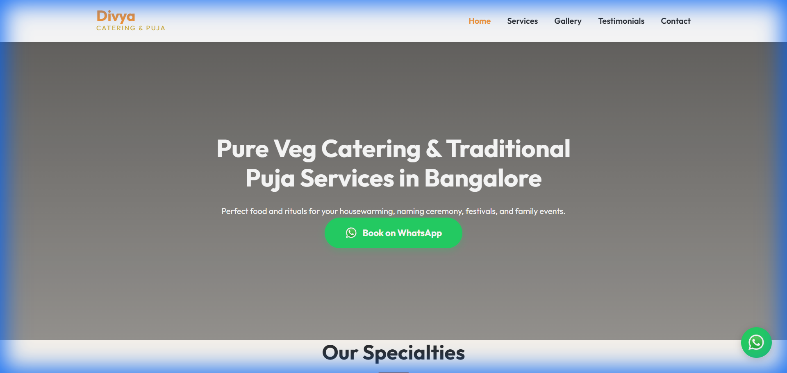
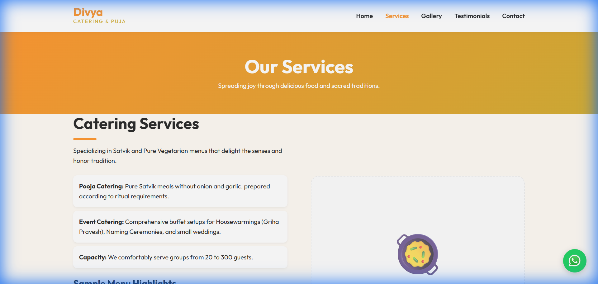
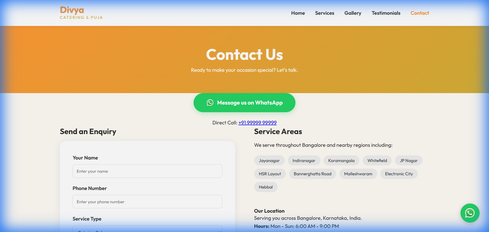
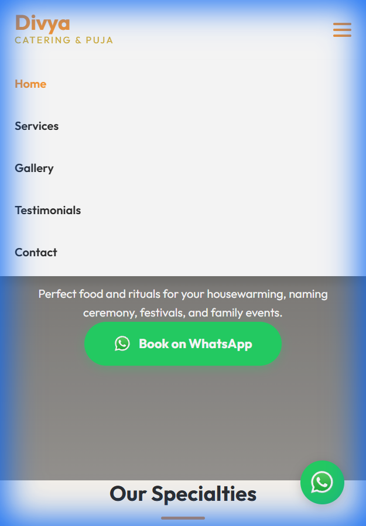

# Readiness & Walkthrough Document: Divya Catering & Puja Services

This document provides a detailed walkthrough of the **Divya Catering & Puja Services** website. Use this as a guide to showcase the final product's features, design rationale, and readiness for launch.

---

## 🔝 1. First Impressions: The Hero Section
The home page is designed to immediately establish trust and prompt action. 

*   **Premium Visuals**: High-quality imagery of traditional South Indian meals and puja arrangements.
*   **Direct CTA**: The vibrant green "Book on WhatsApp" button is the primary goal, allowing customers to start a chat with one click.
*   **Brand Identity**: A saffron and gold theme that signals "Satvik" and "Traditional" quality.

---

## 🍱 2. Deep Dive: Services & Rituals
We've dedicated a section to clearly define the specialty services offered to Bangalore families.

*   **Catering Details**: Mentions of capacity (up to 500 guests) and specific menu types (Satvik, South Indian, North Indian).
*   **Puja Expertise**: Lists major events like Griha Pravesh, Satyanarayan Puja, and Naming Ceremonies.
*   **Enquiry Points**: Each service block has its own WhatsApp link to track which service the customer is interested in.

---

## 📝 3. Conversion Engine: The Contact Form
While WhatsApp is primary, a professional enquiry form is provided for customers who prefer traditional coordination.

*   **Structured Data**: Collects Name, Phone, Service Type, Date, and Guest Count.
*   **Bangalore Service Areas**: A clear list of served areas (Jayanagar, Indiranagar, Koramangala, etc.) to confirm local availability.
*   **Integrated Success Message**: Once submitted, a "Thank You" message appears with a link to continue the conversation on WhatsApp.

---

## 📱 4. Mobile Excellence & Accessibility
Over 80% of catering leads come from mobile. The site is optimized to be lightweight and easy to navigate on a smartphone.

*   **Sticky WhatsApp Button**: Always visible in the bottom-right for instant access.
*   **Clean Navigation**: A toggleable mobile menu ensures the site doesn't feel cluttered on small screens.
*   **Fast Loading**: Optimized assets and clean code ensure a smooth experience even on mobile data.

---

## ✅ Readiness Checklist
- [x] **Responsive**: Verified on Mobile, Tablet, and Desktop.
- [x] **Lead Logic**: All WhatsApp links correctly initiate a chat with a pre-filled message.
- [x] **Asset Integrity**: High-quality images for Hero and Gallery are correctly linked.
- [x] **Navigation**: All internal links (Home, Services, Gallery, etc.) are functional.
- [x] **Contact Flow**: Form captures data and provides user feedback flawlessly.

---

### 🚀 Next Steps
1.  **Review with Client**: Walk through these 4 sections to demonstrate value.
2.  **Domain Connection**: Once approved, the site can be linked to your chosen `.com` or `.in` domain.
3.  **Start Marketing**: Share the link on WhatsApp status and local Facebook groups.
